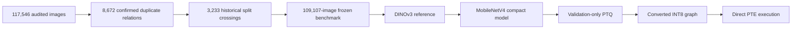

# ResearchWork-CropCop

**An auditable 120-class plant-health recognition study from benchmark reconstruction to a directly executed quantised runtime artifact.**

[](https://github.com/rana-m-ahmed/ResearchWork-CropCop/actions/workflows/validate-artifacts.yml)
[](https://github.com/rana-m-ahmed/ResearchWork-CropCop/actions/workflows/build-paper.yml)

CropCop connects stages that are often reported separately: duplicate-contamination forensics, leakage-group-aware benchmark reconstruction, foundation-model transfer, compact-model training, validation-only post-training quantisation, converted-graph evaluation, and direct execution of the final ExecuTorch/XNNPACK program.

## Headline result

| Model state | Accuracy | Balanced accuracy | Macro-F1 | Evidence state |
| --- | ---: | ---: | ---: | --- |
| DINOv3 ConvNeXt-Tiny reference | 98.5088% | 96.6836% | 96.8700% | Locked internal test |
| MobileNetV4 Conv-Medium float | 98.4599% | 96.2435% | 96.2710% | Selected compact state |
| Converted dynamic INT8 graph | 98.4538% | 96.1957% | 96.2492% | XNNPACK-compatible graph |
| Directly executed PTE | 98.4599% | 96.2017% | 96.2267% | 22.60 MiB runtime artifact |

The final PTE changed only six of 16,363 top-1 decisions relative to the converted graph. Its SHA-256 is published in the model registry, while the binary itself remains restricted pending licence and redistribution review.

> **Scope boundary:** these are leakage-controlled internal results. Source-independent field generalisation, causal benefit from distillation, multi-seed stability, and physical Android performance are not established.

## Evidence chain



## Repository map

| Path | Purpose |
| --- | --- |
| [`paper/`](paper/) | Compilable arXiv LaTeX source, bibliography, PDF, and figure placeholders |
| [`data_card/`](data_card/) | Frozen dataset card, class order, distribution, and dataset fingerprints |
| [`models/`](models/) | State-specific model cards, artifact hashes, and non-distribution notice |
| [`metrics/`](metrics/) | Canonical metric registry and publication-facing summary tables |
| [`evidence/`](evidence/) | Claim ledger, public certificates, derived analyses, and artifact manifests |
| [`notebooks/`](notebooks/) | Output-free sanitized notebooks for freeze, reference training, and PTQ QA |
| [`scripts/`](scripts/) | Repository verification, checksums, paper build, and release packaging |
| [`deployment/`](deployment/) | Runtime contracts and pending physical-device acceptance protocol |
| [`docs/`](docs/) | Reproducibility, scope, provenance, intended use, and release policy |

## Reproduce the public checks

```bash
git clone https://github.com/rana-m-ahmed/ResearchWork-CropCop.git
cd ResearchWork-CropCop
python scripts/validate_repository.py --strict
```

Build the manuscript with a TeX Live installation:

```bash
make paper
```

The validation command checks class order, 120-row per-class tables, headline metrics, model hashes, blocked claims, notebook sanitation, file-size policy, restricted-file patterns, citation metadata, and repository checksums.

## Paper

- Source: [`paper/main.tex`](paper/main.tex)
- Compiled preprint: [`paper/compiled/CropCop_arXiv_Preprint_v1.0.pdf`](paper/compiled/CropCop_arXiv_Preprint_v1.0.pdf)
- Bibliography: [`paper/references.bib`](paper/references.bib)
- Figure plan: [`paper/figures/README.md`](paper/figures/README.md)

The six final figures are intentionally not embedded yet. Styled placeholders preserve the manuscript layout until the publication artwork is frozen.

## Public and restricted artifacts

This repository publishes small, inspectable research derivatives: LaTeX, aggregate metrics, per-class tables, sanitized notebooks, hashes, certificates, and verification code. It does **not** publish the source image corpus, full forensic evidence bundles, checkpoints, raw logits, or the PTE binary. Storage convenience does not grant redistribution rights; see [`docs/EVIDENCE_BOUNDARIES.md`](docs/EVIDENCE_BOUNDARIES.md) and [`models/MODEL_FILES_NOT_DISTRIBUTED.md`](models/MODEL_FILES_NOT_DISTRIBUTED.md).

## Citation

Use the root [`CITATION.cff`](CITATION.cff) or [`CITATION.bib`](CITATION.bib). Once an arXiv identifier is assigned, the preferred citation will be updated without changing the empirical evidence files.

## Licence

Code, scripts, and sanitized notebooks are released under the MIT License. The manuscript, documentation, and original research tables are released under CC BY 4.0. Dataset images, pretrained checkpoints, and restricted artifacts are not relicensed here. See [`LICENSES.md`](LICENSES.md).
