<div align="center">

# CropCop

### An auditable 120-class plant-health model from benchmark reconstruction to a quantised runtime artifact

[](#preprint-status)
[](https://github.com/rana-m-ahmed/ResearchWork-CropCop/actions/workflows/validate-artifacts.yml)
[](pyproject.toml)
[](https://pytorch.org/executorch/)
[](LICENSES.md)

**109,107 frozen images · 120 operational classes · 22.60 MiB executed PTE · 6 / 16,363 changed runtime decisions**

CropCop is a leakage-controlled plant-health recognition study and public reproducibility repository. It connects benchmark forensics, long-tailed model evaluation, compact transfer, validation-only post-training quantisation, and direct execution of an identified ExecuTorch/XNNPACK artifact.

[Results](#headline-results) · [Evidence chain](#evidence-chain) · [Repository map](#repository-map) · [Reproducibility](#reproducibility) · [Limitations](#scope-and-limitations) · [Citation](#citation)

</div>

---

## Why this repository exists

High classification accuracy is not sufficient evidence when a benchmark may contain duplicate image families, the label space is severely imbalanced, or the file intended for deployment was never evaluated directly.

CropCop treats the complete research lineage as the object of study:

1. audit the inherited image collection;
2. reconstruct a leakage-group-aware benchmark;
3. freeze the class map, preprocessing contract, and evaluation rows;
4. evaluate a strong DINOv3 ConvNeXt-Tiny reference;
5. carry the result into a compact MobileNetV4 lineage;
6. select post-training quantisation using validation data only;
7. evaluate the converted INT8 graph;
8. execute the final serialized PTE on every locked test row;
9. bind the resulting claims to prediction records, fingerprints, and cryptographic identifiers.

The contribution is the **connected evidence chain**. CropCop does not claim a new backbone, loss function, distillation method, or universally superior quantisation scheme.

## Headline results

### Frozen benchmark

| Property | Value |
| --- | ---: |
| Audited source images | 117,546 |
| Final frozen images | 109,107 |
| Operational classes | 120 |
| Train / validation / test | 76,376 / 16,368 / 16,363 |
| Confirmed duplicate relationships | 8,672 |
| Historical cross-split relationships | 3,233 |
| Direct-cover duplicate removals | 8,355 |
| Audited leakage groups crossing final splits | **0** |
| Largest-to-smallest class ratio | 151.7× |

### Model-state performance on the locked internal test

| State | Object | Accuracy | Balanced accuracy | Macro-F1 | Errors |
| --- | --- | ---: | ---: | ---: | ---: |
| Reference | DINOv3 ConvNeXt-Tiny | 98.5088% | 96.6836% | 96.8700% | 244 |
| Compact float | MobileNetV4 Conv-Medium | 98.4599% | 96.2435% | 96.2710% | 252 |
| Converted INT8 | XNNPACK-compatible graph | 98.4538% | 96.1957% | 96.2492% | 253 |
| Executed runtime | Serialized ExecuTorch/XNNPACK PTE | 98.4599% | 96.2017% | 96.2267% | 252 |

The final runtime artifact contains **23,696,352 bytes (22.60 MiB)**. Its predictions differed from the converted INT8 graph on only **6 of 16,363** rows. The exact PTE SHA-256 is recorded in [`metrics/metric_registry.json`](metrics/metric_registry.json).

The reference-to-PTE comparison showed near parity in aggregate accuracy, but not a completely lossless transition: paired analysis identified a modest reduction in macro-F1 concentrated primarily among low-support and broad fruit-condition categories.

## Evidence chain

```mermaid
flowchart LR
    A[117,546 audited images] --> B[8,672 trusted duplicate relations]
    B --> C[3,233 historical split crossings]
    C --> D[109,107-image group-safe benchmark]
    D --> E[DINOv3 ConvNeXt-Tiny reference]
    E --> F[MobileNetV4 compact state]
    F --> G[Validation-only PTQ selection]
    G --> H[Converted INT8 graph]
    H --> I[Direct PTE execution]
    I --> J[Row-level paired audit + SHA-256 identity]
```



Every major transition is represented by one or more of the following:

- a frozen data or class-map fingerprint;
- a configuration fingerprint;
- stable row identifiers and prediction records;
- a validation-only selection record;
- a state-specific metric table;
- an artifact byte count and SHA-256 digest;
- a public claim-to-evidence entry.

See [`evidence/public/claim_evidence_matrix.csv`](evidence/public/claim_evidence_matrix.csv) for the public claim ledger.

## Research questions

CropCop is organized around three bounded questions:

- **RQ1 — Benchmark validity:** can a heterogeneous image aggregate be reconstructed so that confirmed duplicate families do not cross the final partitions?
- **RQ2 — Model retention:** how much class-balanced performance remains when a strong reference is carried into a compact MobileNetV4 lineage?
- **RQ3 — Runtime fidelity:** does the selected quantised graph survive serialization and direct ExecuTorch/XNNPACK execution without materially changing its predictions?

These questions are intentionally narrower than “does the system work on unseen farms?” That requires a source-independent cohort and is not established by the current internal benchmark.

## Method overview

### 1. Benchmark reconstruction

The inherited partition was rejected after the audit confirmed 3,233 duplicate relationships crossing historical train, validation, and test boundaries. Exact identity, strong hash evidence, corrected feature/geometric verification, conservative direct-cover removal, and a limited manual quality review were used to construct the final benchmark.

### 2. Reference and compact states

- **Reference:** fully fine-tuned DINOv3 ConvNeXt-Tiny, selected by validation macro-F1.
- **Compact state:** MobileNetV4 Conv-Medium, evaluated as the completed teacher-guided lineage.

The repository does not claim that teacher guidance caused the compact result because a matched direct MobileNetV4 baseline is not preserved.

### 3. Quantisation and runtime

Three predeclared XNNPACK-compatible PTQ candidates were evaluated on the validation split. Dynamic activation quantisation with per-channel weights was selected before locked-test evaluation. The converted graph was then lowered and serialized into the final PTE, which generated its own prediction record on all test rows.

## Repository map

| Path | Purpose |
| --- | --- |
| [`data_card/`](data_card/) | Frozen dataset identity, fingerprints, and distribution boundaries |
| [`metrics/`](metrics/) | Canonical result tables, diagnostic probes, PTQ candidates, and metric registry |
| [`evidence/public/`](evidence/public/) | Public claim-to-evidence mapping and derived evidence |
| [`evidence/restricted/`](evidence/restricted/) | Documentation of evidence intentionally excluded from the public repository |
| [`models/`](models/) | Model-state identifiers, hashes, and non-distribution notice |
| [`paper/`](paper/) | Manuscript status and paper-release boundary |
| [`docs/`](docs/) | Reproducibility, provenance, intended use, limitations, release policy, and V2 validation planning |
| [`scripts/`](scripts/) | Repository-contract and consistency validation utilities |
| [`tests/`](tests/) | Automated repository-contract tests |
| [`releases/`](releases/) | Release packaging policy |

## Reproducibility

Clone the repository and run the public validation contract:

```bash
git clone https://github.com/rana-m-ahmed/ResearchWork-CropCop.git
cd ResearchWork-CropCop
python scripts/validate_repository.py --strict
```

Run the repository tests:

```bash
python -m pytest -q
```

The public checks validate, among other things:

- frozen dataset counts;
- presence of all four evaluated model states;
- final PTE byte count and SHA-256;
- blocked claims that must remain outside the supported evidence boundary;
- absence of restricted model binaries and common credential patterns;
- consistency between registries and public claim records.

Detailed reproducibility notes are available in [`docs/REPRODUCIBILITY.md`](docs/REPRODUCIBILITY.md).

## Public and restricted artifacts

This repository publishes small, inspectable research derivatives such as aggregate metrics, fingerprints, claim ledgers, state registries, verification scripts, and documentation.

The following are **not** distributed in the public Git history:

- the consolidated source image corpus;
- model checkpoints;
- the final PTE binary;
- raw logits and large prediction bundles;
- restricted forensic evidence;
- credentials or private working paths.

The exclusions are deliberate. Storage availability does not establish image, checkpoint, or derivative-artifact redistribution rights. See [`docs/EVIDENCE_BOUNDARIES.md`](docs/EVIDENCE_BOUNDARIES.md), [`data_card/DATA_NOT_DISTRIBUTED.md`](data_card/DATA_NOT_DISTRIBUTED.md), and [`models/MODEL_FILES_NOT_DISTRIBUTED.md`](models/MODEL_FILES_NOT_DISTRIBUTED.md).

## Scope and limitations

> [!IMPORTANT]
> CropCop is a **closed-set research classifier**, not an autonomous agronomic diagnostic system or treatment recommender.

The current results establish leakage-controlled **internal** recognition and software-runtime fidelity. They do not establish:

- performance on unseen farms, regions, cultivars, camera pipelines, or acquisition protocols;
- physical Android latency, memory, energy, delegate fallback, or thermal behavior;
- multi-seed training stability;
- causal gains from DINOv3 pretraining or teacher-guided compact training;
- complete source provenance or redistribution rights for every image;
- reliable behavior on unsupported crops, novel diseases, non-plant inputs, or open-set conditions.

The next evidence stage is a source-independent smartphone cohort plus prespecified physical-device evaluation. No new model or threshold should be selected using the already consumed internal test set. The bounded V2 protocol is documented in [`docs/V2_DEPLOYMENT_VALIDATION_PLAN.md`](docs/V2_DEPLOYMENT_VALIDATION_PLAN.md).

See [`docs/LIMITATIONS.md`](docs/LIMITATIONS.md) and [`docs/INTENDED_USE.md`](docs/INTENDED_USE.md).

## Preprint status

The manuscript **“CropCop: An Auditable 120-Class Plant-Health Model from Benchmark Reconstruction to a Quantised Runtime Artifact”** has been submitted to arXiv.

The public arXiv identifier and canonical abstract-page link will be added only after assignment. Until then, this repository should be cited using the repository citation metadata and the submitted-preprint title. Submission does not imply arXiv announcement, endorsement, or peer review.

The current repository metadata release remains `0.2.0-rc2`. See [`MANUSCRIPT_STATUS.md`](MANUSCRIPT_STATUS.md) for the submission and release boundary.

## Authors

- **Rana Muhammad Ahmed** — Department of Computer Science, Bahria University Islamabad; corresponding author
- **Sabahat Abbas** — Department of Computer Science, Bahria University Islamabad

Correspondence: [01-134241-039@student.bahria.edu.pk](mailto:01-134241-039@student.bahria.edu.pk)

## Citation

GitHub can generate a citation from [`CITATION.cff`](CITATION.cff). A BibTeX entry is also available in [`CITATION.bib`](CITATION.bib).

```bibtex
@misc{ahmed2026cropcop,
  author       = {Rana Muhammad Ahmed and Sabahat Abbas},
  title        = {CropCop: An Auditable 120-Class Plant-Health Model from Benchmark Reconstruction to a Quantised Runtime Artifact},
  year         = {2026},
  howpublished = {Submitted preprint and reproducibility repository},
  url          = {https://github.com/rana-m-ahmed/ResearchWork-CropCop},
  note         = {arXiv identifier pending}
}
```

The citation metadata will be updated with the assigned arXiv identifier without changing the scientific claim boundary.

## Contributing and corrections

Reproducibility reports, provenance corrections, and documentation fixes are welcome. Please read [`CONTRIBUTING.md`](CONTRIBUTING.md) before opening a pull request. Use the repository issue templates for evidence or provenance concerns.

## Licence

- Code and validation scripts: **MIT License**
- Manuscript text, original documentation, and original research tables: **CC BY 4.0**
- Dataset images, pretrained checkpoints, and restricted artifacts: **not relicensed by this repository**

See [`LICENSES.md`](LICENSES.md) for the complete licensing boundary.

---

<div align="center">

**Research integrity over headline accuracy.**

</div>
