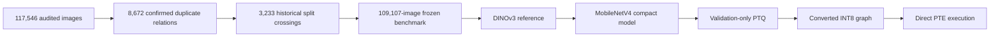

# ResearchWork-CropCop

**An auditable 120-class plant-health recognition study from benchmark reconstruction to a directly executed quantised runtime artifact.**

[](https://github.com/rana-m-ahmed/ResearchWork-CropCop/actions/workflows/validate-artifacts.yml)

CropCop connects stages that are often reported separately: duplicate-contamination forensics, leakage-group-aware benchmark reconstruction, foundation-model transfer, compact-model training, validation-only post-training quantisation, converted-graph evaluation, and direct execution of the final ExecuTorch/XNNPACK program.

## Authors

- **Rana Muhammad Ahmed** — Department of Computer Science, Bahria University Islamabad; corresponding author
- **Sabahat Abbas** — Department of Computer Science, Bahria University Islamabad

Correspondence: [01-134241-039@student.bahria.edu.pk](mailto:01-134241-039@student.bahria.edu.pk)

## Headline result

| Model state | Accuracy | Balanced accuracy | Macro-F1 | Evidence state |
| --- | ---: | ---: | ---: | --- |
| DINOv3 ConvNeXt-Tiny reference | 98.5088% | 96.6836% | 96.8700% | Locked internal test |
| MobileNetV4 Conv-Medium float | 98.4599% | 96.2435% | 96.2710% | Selected compact state |
| Converted dynamic INT8 graph | 98.4538% | 96.1957% | 96.2492% | XNNPACK-compatible graph |
| Directly executed PTE | 98.4599% | 96.2017% | 96.2267% | 22.60 MiB runtime artifact |

The final PTE changed only six of 16,363 top-1 decisions relative to the converted graph. Its SHA-256 is published in the metric registry, while the binary itself remains restricted pending licence and redistribution review.

> **Scope boundary:** these are leakage-controlled internal results. Source-independent field generalisation, causal benefit from distillation, multi-seed stability, and physical Android performance are not established.

## Evidence chain



## Revised preprint status

The professionally typeset **v0.2.0-rc2** manuscript is a 20-page, six-figure release candidate authored by Rana Muhammad Ahmed and Sabahat Abbas. The revision fixes the Section 9 repository hyperlink, clarifies the interpretation of missing host CPU/thread/OS details, and standardises human-facing **arXiv** capitalization.

The final deterministic compiled PDF has SHA-256:

```text
000e1a6bc4590b6ce840eb76ee8ef43754f2b74f238865483d38f189108cc904
```

See [`MANUSCRIPT_STATUS.md`](MANUSCRIPT_STATUS.md) for the editorial patch record and release boundary. The current `main` branch remains the public evidence bootstrap until the complete validated paper tree is synchronized and reviewed.

## Repository map

| Path | Purpose |
| --- | --- |
| [`data_card/`](data_card/) | Frozen dataset identity and provenance boundaries |
| [`models/`](models/) | Model identities, hashes, and non-distribution notice |
| [`metrics/`](metrics/) | Canonical metric registry and publication-facing result tables |
| [`evidence/`](evidence/) | Claim ledger and public evidence derivatives |
| [`scripts/`](scripts/) | Repository validation utilities |
| [`docs/`](docs/) | Reproducibility, scope, provenance, intended use, and release policy |

## Reproduce the current public checks

```bash
git clone https://github.com/rana-m-ahmed/ResearchWork-CropCop.git
cd ResearchWork-CropCop
python scripts/validate_repository.py --strict
```

## Public and restricted artifacts

This repository publishes small, inspectable research derivatives such as aggregate metrics, hashes, certificates, and verification code. It does **not** publish the source image corpus, full forensic evidence bundles, checkpoints, raw logits, or the PTE binary. Storage convenience does not grant redistribution rights; see [`docs/EVIDENCE_BOUNDARIES.md`](docs/EVIDENCE_BOUNDARIES.md) and [`models/MODEL_FILES_NOT_DISTRIBUTED.md`](models/MODEL_FILES_NOT_DISTRIBUTED.md).

## Citation

Use [`CITATION.cff`](CITATION.cff) or [`CITATION.bib`](CITATION.bib). The current metadata release candidate is `0.2.0-rc2`. Once an arXiv identifier is assigned and the complete paper tree is merged, the immutable preprint tag and preferred citation will be frozen.

## Licence

Code and validation scripts are released under the MIT License. The manuscript, documentation, and original research tables are released under CC BY 4.0. Dataset images, pretrained checkpoints, and restricted artifacts are not relicensed here. See [`LICENSES.md`](LICENSES.md).
